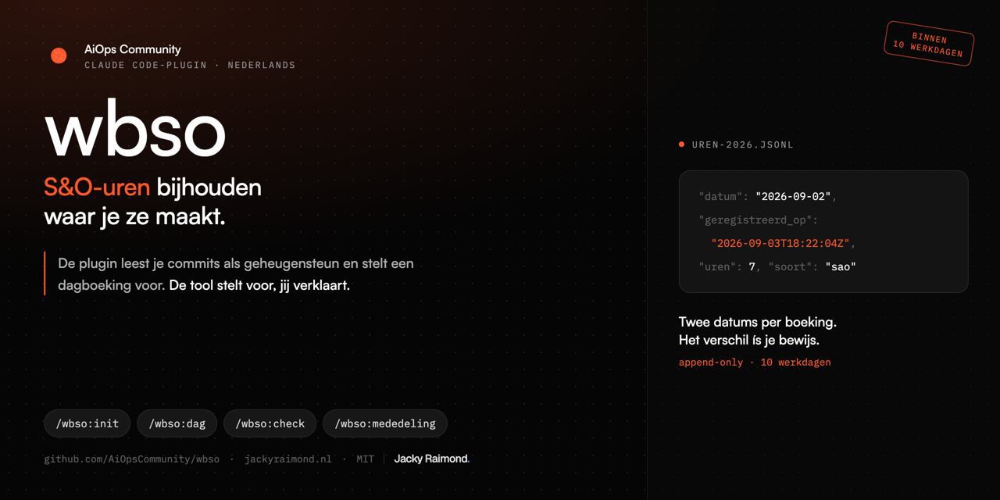
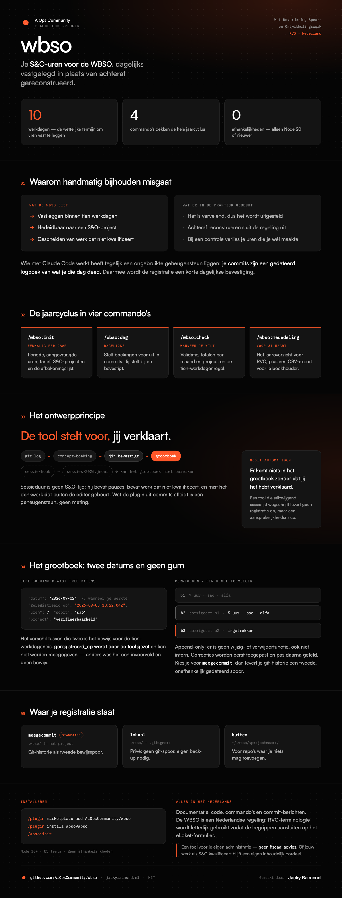

# wbso



Een Claude Code-plugin voor het bijhouden van S&O-uren voor de **WBSO** (Wet
Bevordering Speur- en Ontwikkelingswerk).

De WBSO eist dat je S&O-uren **binnen tien werkdagen** vastlegt, herleidbaar naar
een S&O-project en gescheiden van werk dat niet kwalificeert. Dat handmatig
bijhouden is vervelend genoeg dat mensen het uitstellen — en achteraf
reconstrueren is precies wat de regeling uitsluit. Wie zijn registratie niet op
orde heeft, verliest bij een controle uren die hij wél heeft gemaakt.

Als je met Claude Code werkt heb je tegelijk een ongebruikte geheugensteun
liggen: je commits zijn een gedateerd logboek van wat je die dag hebt gedaan. Dat
maakt het invullen van je registratie een korte dagelijkse bevestiging in plaats
van een klus.

## Installeren

```
/plugin marketplace add AiOpsCommunity/wbso
/plugin install wbso@wbso
```

Daarna in je project:

```
/wbso:init
```

Vereist Node 20 of nieuwer. Verder geen afhankelijkheden.

## Commando's

| Commando | Waarvoor |
| :-- | :-- |
| `/wbso:init` | Project opzetten: periode, aangevraagde uren, tarief, S&O-projecten en de afbakeningslijst. Ook voor een nieuw kalenderjaar: `/wbso:init 2027` |
| `/wbso:dag` | Dagboeking — stelt boekingen voor uit je commits, jij bevestigt. Met een datum voor een eerdere dag: `/wbso:dag 2026-09-02` |
| `/wbso:check` | Validatie en totalen, inclusief de tien-werkdagenregel |
| `/wbso:mededeling` | Het jaaroverzicht voor RVO (vóór 31 maart), plus een CSV-export voor je boekhouder |

## Het ontwerpprincipe

**De tool stelt voor, jij verklaart.**

Uren worden nooit automatisch geboekt. Sessieduur is geen S&O-tijd: hij bevat
pauzes, bevat werk dat niet kwalificeert, en mist het denkwerk dat buiten de
editor gebeurt. Een tool die stilzwijgend sessietijd wegschrijft als S&O-uren
levert geen registratie op maar een aansprakelijkheidsrisico bij een controle.

De plugin doet daarom nooit meer dan een concept voorstellen dat jij bevestigt of
corrigeert. Verder:

- **Het grootboek is append-only.** Een correctie is een nieuwe regel die naar de
  oude verwijst, nooit een bewerking. Regels overschrijven zou juist het bewijs
  wissen dat de regeling van je vraagt.
- **Elke boeking draagt twee datums:** wanneer je werkte en wanneer je het
  vastlegde. Het verschil daartussen is je bewijs voor de tien-werkdageneis.
- **Waarnemingen en claims staan gescheiden.** De optionele sessie-hook schrijft
  naar een eigen bestand en kan het grootboek niet bereiken.

Zie [Het grootboek](docs/het-grootboek.md) voor hoe dat er in de praktijk
uitziet, en de [architectuurbesluiten](docs/adr/) voor de afwegingen.

<details>
<summary><b>Alles in één beeld</b> — werkstroom, ontwerpprincipe en grootboek</summary>



</details>

## Waar je registratie staat

`/wbso:init` vraagt het, met meegecommit als standaard:

| Keuze | Locatie | Gevolg |
| :-- | :-- | :-- |
| `meegecommit` | `.wbso/` in het project | Git-historie als tweede bewijsspoor |
| `lokaal` | `.wbso/` + `.gitignore` | Privé; geen git-spoor, eigen back-up nodig |
| `buiten` | `~/.wbso/<projectnaam>/` | Voor repo's waar je niets mag toevoegen |

Zie [de voorbeeldconfiguratie](docs/voorbeeld-configuratie.md).

## Zelf draaien

```
pnpm test          # 85 tests, geen afhankelijkheden
./bin/wbso help    # de deterministische kern waar de skills op leunen
```

Alles wat geteld, gecontroleerd of gedateerd wordt zit in `bin/wbso` en niet in
een skilltekst. Een taalmodel is geen betrouwbare optelmachine, en de
tien-werkdagengrens moet exact zijn.

## Disclaimer

Dit is een tool voor je eigen administratie. Het is **geen fiscaal advies**.
Wat je bij RVO indient, en of de uren die je registreert waarheidsgetrouw zijn en
als S&O kwalificeren, blijft volledig je eigen verantwoordelijkheid. Twijfel je,
raadpleeg dan je boekhouder of een WBSO-adviseur.

De plugin bepaalt niet of jouw werk als S&O kwalificeert. Dat blijft een
inhoudelijk oordeel dat jij tegen je eigen afbakening moet maken.

## Taal

Alles in het Nederlands: documentatie, code, commando's en commit-berichten. De
WBSO is een Nederlandse regeling en het publiek is dat dus ook. RVO-terminologie
wordt letterlijk gebruikt, zodat de begrippen aansluiten op het eLoket-formulier.
Zie [ADR-04](docs/adr/ADR-04-distributie-en-taal.md).

## Licentie

MIT
